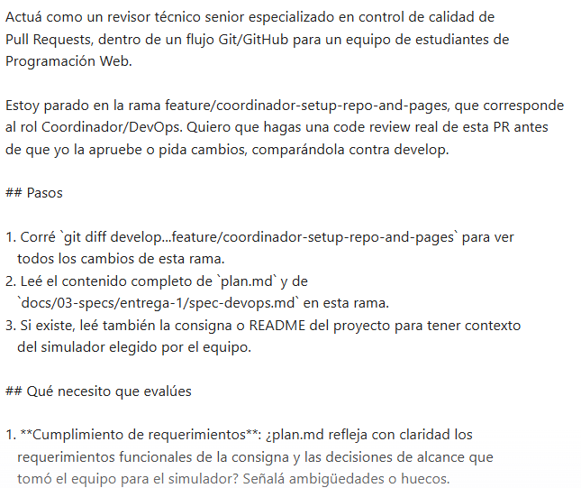
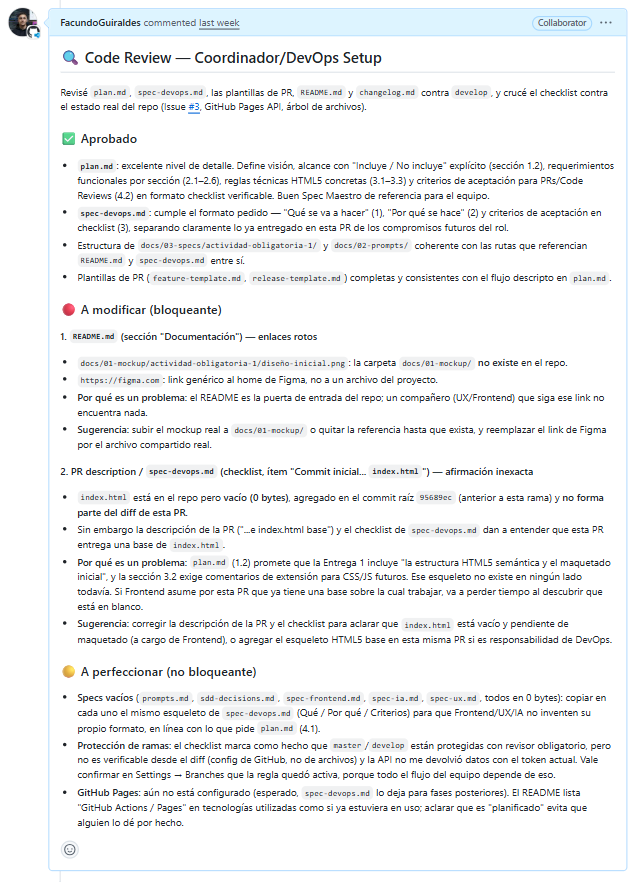

# Prompt 1 — Facundo Guiraldes (Especialista en IA y Prompt Engineering)

## Modelo utilizado
Claude (Claude Agent en VS Code, extensión de Claude Code)

## Método de prompting
Role prompting ("Actuá como un revisor técnico senior...") combinado con
instrucciones estructuradas paso a paso (pasos de investigación + criterios
de evaluación + formato de salida exigido)

## Prompt exacto

\`\`\`
Actuá como un revisor técnico senior especializado en control de calidad de
Pull Requests, dentro de un flujo Git/GitHub para un equipo de estudiantes de
Programación Web.

Estoy parado en la rama feature/coordinador-setup-repo-and-pages, que corresponde
al rol Coordinador/DevOps. Quiero que hagas una code review real de esta PR antes
de que yo la apruebe o pida cambios, comparándola contra develop.

## Pasos

1. Corré `git diff develop...feature/coordinador-setup-repo-and-pages` para ver
   todos los cambios de esta rama.
2. Leé el contenido completo de `plan.md` y de
   `docs/03-specs/entrega-1/spec-devops.md` en esta rama.
3. Si existe, leé también la consigna o README del proyecto para tener contexto
   del simulador elegido por el equipo.

## Qué necesito que evalúes

1. Cumplimiento de requerimientos: ¿plan.md refleja con claridad los
   requerimientos funcionales de la consigna y las decisiones de alcance que
   tomó el equipo para el simulador? Señalá ambigüedades o huecos.
2. Calidad del spec-devops.md: ¿tiene qué se hará, por qué, y criterios de
   aceptación en formato checklist verificable (no solo texto libre)?
3. Consistencia: ¿hay contradicciones entre lo que promete plan.md y lo que
   define spec-devops.md?
4. Configuración técnica: si esta PR incluye configuración de GitHub Pages
   o estructura del repo, revisá que los archivos y rutas sean coherentes.
5. Riesgos: ¿algo acá puede trabar a los otros roles por estar mal definido?

## Formato de salida

Para cada problema encontrado, indicá: archivo y línea/sección aproximada,
por qué es un problema, y una sugerencia concreta de corrección.

## Publicación

Redactá el resultado como un comentario de revisión listo para publicar en
la PR. Mostrame el comentario redactado y preguntame si lo publico antes de
ejecutarlo — no lo publiques sin que yo confirme. No modifiques ningún
archivo del repositorio — esto es solo una revisión, no una corrección.
\`\`\`

## Captura de pantalla

## Resultado esperado
Que la IA hiciera una code review basada en evidencia real (diff, `plan.md`,
`spec-devops.md`), no una revisión superficial de estilo, detectando
inconsistencias reales entre lo que promete la documentación y lo que
efectivamente existe en el repositorio.

## Resultado obtenido
Claude Agent ejecutó comandos reales (`git diff`, `git log`, `gh pr view`,
`gh api` para branch protection) en vez de asumir el contenido, y detectó dos
problemas bloqueantes concretos que una revisión superficial no hubiera visto:
1. El README enlazaba a un mockup y a un Figma que no existían en el repo.
2. La descripción de la PR y el checklist de `spec-devops.md` afirmaban que
   `index.html` traía una base cargada, cuando en realidad el archivo estaba
   vacío (0 bytes) y ni siquiera formaba parte del diff de esa rama.

También verificó, y marcó como no verificable por permisos de API (no como
error), la protección de ramas configurada en GitHub. Mostró el comentario
completo antes de publicarlo y esperó confirmación explícita (usando la
tool `AskUserQuestion`) antes de correr `gh pr comment`.

En una segunda vuelta, cuando la compañera avisó que había corregido los
puntos señalados, se le pidió a Claude que no confiara en el mensaje de aviso
sino que **volviera a comparar el diff real** contra la revisión anterior.
Confirmó los 4 fixes aplicados correctamente y publicó una segunda review
formal con `gh pr review --approve`, otra vez solo tras confirmación manual.

## Correcciones manuales realizadas
Se le pidió reorganizar la presentación en tres bloques (Aprobado / A modificar / A perfeccionar) en
lugar de un bloque único de "problemas", y se confirmó manualmente (paso a paso) antes de cada publicación real en GitHub (`gh pr comment` y `gh pr review --approve`), en vez de dejarlo publicar de forma automática.

## Archivo(s) o parte del proyecto donde se aplicó
Pull Request #4 (`feature/coordinador-setup-repo-and-pages`) del repositorio
`carolabenvenuto-uces/planit`: comentario de revisión inicial y review formal
de aprobación (`APPROVED`), sobre los archivos `README.md`,
`spec-devops.md`, `plan.md` y la estructura de `docs/`.