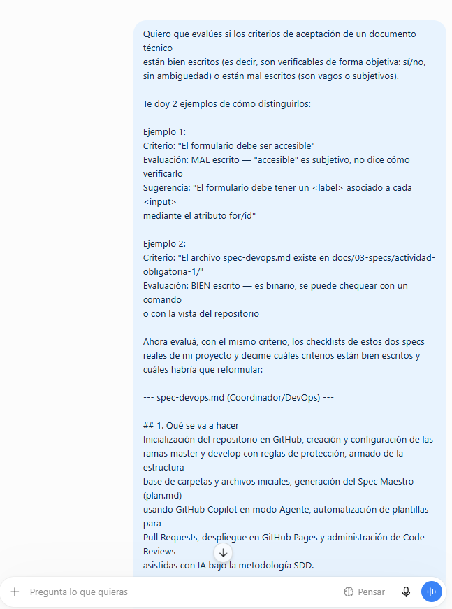
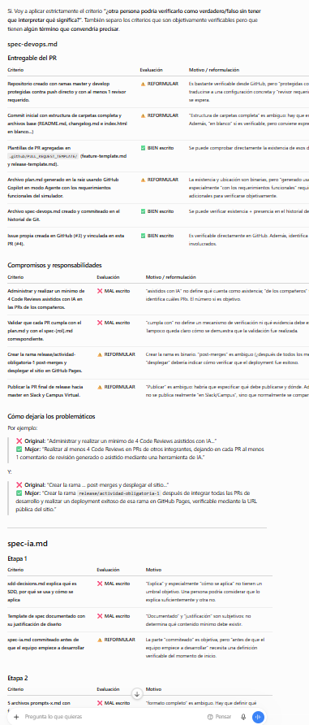

# Prompt 3 — Facundo Guiraldes (Especialista en IA y Prompt Engineering)

## Modelo utilizado
ChatGPT (chatgpt.com)

## Método de prompting
Few-shot (se dieron 2 ejemplos completos de criterio bien escrito vs. mal
escrito, con su evaluación y sugerencia de reformulación, antes de pedir
que aplique el mismo criterio a los specs reales)

## Prompt exacto

\`\`\`
Quiero que evalúes si los criterios de aceptación de un documento técnico
están bien escritos (es decir, son verificables de forma objetiva: sí/no,
sin ambigüedad) o están mal escritos (son vagos o subjetivos).

Te doy 2 ejemplos de cómo distinguirlos:

Ejemplo 1:
Criterio: "El formulario debe ser accesible"
Evaluación: MAL escrito — "accesible" es subjetivo, no dice cómo verificarlo
Sugerencia: "El formulario debe tener un <label> asociado a cada <input>
mediante el atributo for/id"

Ejemplo 2:
Criterio: "El archivo spec-devops.md existe en docs/03-specs/actividad-obligatoria-1/"
Evaluación: BIEN escrito — es binario, se puede chequear con un comando
o con la vista del repositorio

Ahora evaluá, con el mismo criterio, los checklists de estos dos specs
reales de mi proyecto y decime cuáles criterios están bien escritos y
cuáles habría que reformular:

--- spec-devops.md (Coordinador/DevOps) ---
[contenido completo del checklist de spec-devops.md]

--- spec-ia.md (Especialista en IA) ---
[contenido completo del checklist de spec-ia.md]
\`\`\`

## Captura de pantalla

## Resultado esperado
Detectar, siguiendo el patrón de los 2 ejemplos dados, cuáles criterios de
aceptación de los specs del equipo son realmente verificables (binarios,
sin ambigüedad) y cuáles son vagos o subjetivos, para poder mejorar la
calidad de la metodología SDD aplicada por el equipo.

## Resultado obtenido
ChatGPT clasificó los 14 criterios evaluados en tres categorías: 3 bien
escritos (ej. la existencia de las plantillas de PR, el commit de
spec-devops.md, la vinculación de la Issue #3 a la PR #4), 5 verificables
en parte pero que convenía precisar, y 6 ambiguos o subjetivos que debían
reformularse (ej. "sdd-decisions.md explica qué es SDD", "conclusión
fundada", "cumpla con"). Identificó un patrón común: palabras como
"completo", "explica", "justificación" o "fundada" no tienen un umbral
objetivo de verificación. Propuso reformulaciones concretas para los
criterios más problemáticos y cerró con una regla práctica general para
escribir criterios de aceptación verificables.

## Correcciones manuales realizadas
Ninguna corrección sobre el contenido generado. Se usó tal cual como
insumo de reflexión sobre la calidad de los specs del equipo; no se
modificaron los archivos `spec-devops.md` ni `spec-ia.md` en esta entrega,
ya que ambos ya estaban aprobados y mergeados. Las reformulaciones
sugeridas quedan como mejora a considerar en la próxima iteración de SDD
del equipo.

## Archivo(s) o parte del proyecto donde se aplicó
`docs/03-specs/actividad-obligatoria-1/spec-devops.md` y
`docs/03-specs/actividad-obligatoria-1/spec-ia.md` — auditoría de calidad
de la metodología SDD aplicada, sin modificación de código en esta entrega.