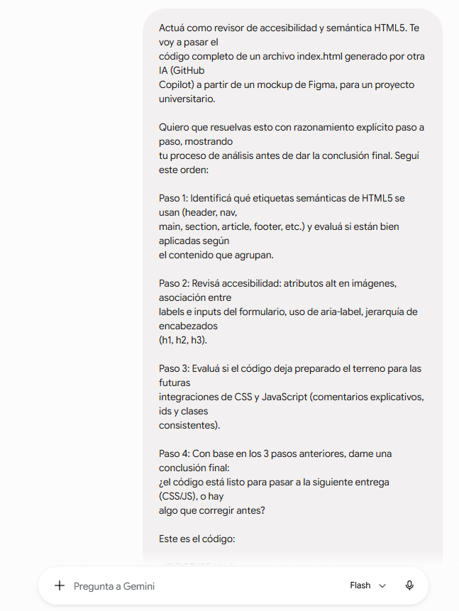
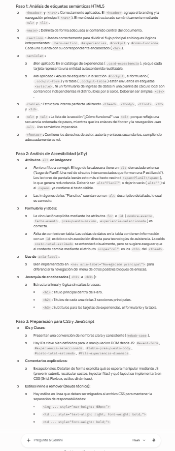

# Prompt 4 — Facundo Guiraldes (Especialista en IA y Prompt Engineering)

## Modelo utilizado
Gemini Flash (vía gemini.google.com)

## Método de prompting
Chain-of-thought (razonamiento explícito paso a paso, con 4 pasos definidos
en el prompt: semántica, accesibilidad, preparación para CSS/JS, conclusión)

## Prompt exacto

\`\`\`
Actuá como revisor de accesibilidad y semántica HTML5. Te voy a pasar el
código completo de un archivo index.html generado por otra IA (GitHub
Copilot) a partir de un mockup de Figma, para un proyecto universitario.

Quiero que resuelvas esto con razonamiento explícito paso a paso, mostrando
tu proceso de análisis antes de dar la conclusión final. Seguí este orden:

Paso 1: Identificá qué etiquetas semánticas de HTML5 se usan (header, nav,
main, section, article, footer, etc.) y evaluá si están bien aplicadas según
el contenido que agrupan.

Paso 2: Revisá accesibilidad: atributos alt en imágenes, asociación entre
labels e inputs del formulario, uso de aria-label, jerarquía de encabezados
(h1, h2, h3).

Paso 3: Evaluá si el código deja preparado el terreno para las futuras
integraciones de CSS y JavaScript (comentarios explicativos, ids y clases
consistentes).

Paso 4: Con base en los 3 pasos anteriores, dame una conclusión final:
¿el código está listo para pasar a la siguiente entrega (CSS/JS), o hay
algo que corregir antes?

Este es el código:
[index.html completo del proyecto, correspondiente a la PR de Valeria
(Desarrollador Frontend)]
\`\`\`

## Captura de pantalla

## Resultado esperado
Obtener una segunda opinión, con un modelo y método distintos a los ya
documentados en el equipo, sobre la calidad semántica y de accesibilidad
del `index.html` generado por Copilot — no como revisión bloqueante de PR,
sino como auditoría de calidad de cara a la siguiente entrega (CSS/JS), y
como insumo real para comparar el estilo de análisis de Gemini contra el de
Claude en `comparativa-modelos.md`.

## Resultado obtenido
Siguiendo los 4 pasos pedidos, Gemini identificó: uso incorrecto de
`<article>` en dos bloques del Cockpit Operativo (formulario y tabla, que
deberían ser `
` porque no son contenido autocontenido/distribuible);
un `alt` redundante en el logo del header (duplica el texto visible del
`` vecino); falta de `scope="col"` en los encabezados de la tabla; y
estilos inline (`style="..."`) pendientes de migrar a CSS externo. Concluyó
que el código no está listo al 100%, pero que las correcciones necesarias
son mínimas (menos de 2 minutos de trabajo) antes de avanzar a la etapa de
CSS/JS.

## Correcciones manuales realizadas
Ninguna corrección se aplicó sobre el código en esta entrega: la PR de
Valeria ya estaba aprobada y mergeada a `develop` al momento de este
análisis, por lo que este prompt se usó como auditoría posterior, no como
revisión previa al merge. Las observaciones de Gemini (etiquetas `<article>`
mal usadas, `alt` redundante, falta de `scope`, estilos inline) quedan
documentadas como recomendación concreta para la próxima entrega, cuando el
equipo trabaje sobre CSS y JavaScript.

## Archivo(s) o parte del proyecto donde se aplicó
`index.html` — análisis de calidad posterior al merge, sin modificación de
código en esta entrega. Usado como insumo real y comparable para
`docs/02-prompts/comparativa-modelos.md`.