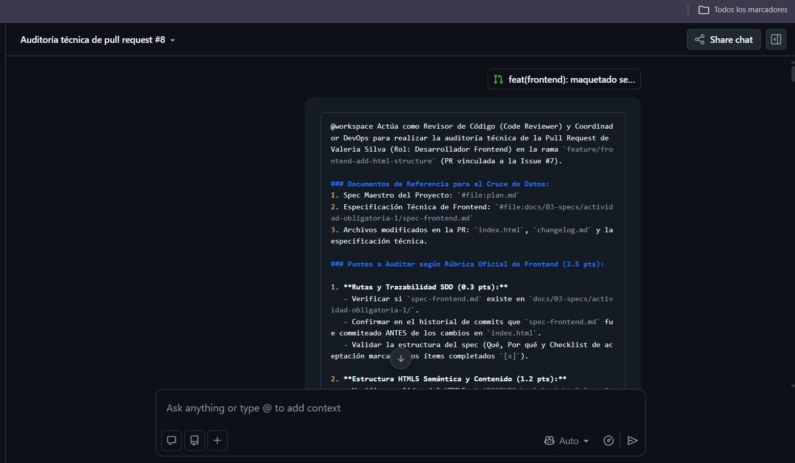
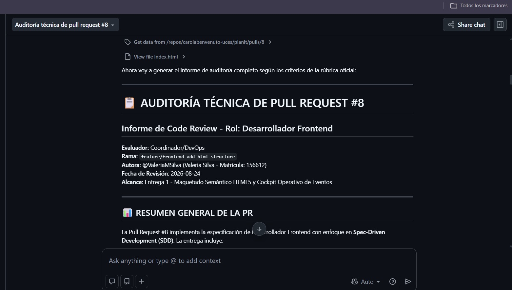

# Prompt 5 — Carola Benvenuto (Coordinadora / DevOps)

## Modelo utilizado
GitHub Copilot en modo Agente, con selección de modelo en "Auto" (Copilot
elige automáticamente entre varios modelos disponibles según la tarea; no
es posible determinar con certeza cuál corrió específicamente en este caso)

## Método de prompting
Role prompting con instrucciones estructuradas ("Actúa como Líder Técnico
y DevOps..." + estructura Markdown detallada punto por punto)

## Prompt exacto

\`\`\`
@workspace /agent Actúa como Líder Técnico y DevOps para la Actividad
Obligatoria N°1 de Programación Web I (UCES). Necesito que edites y
completes el archivo plan.md existente en la raíz del repositorio. Este
archivo debe actuar como el "Spec Maestro" del proyecto para aplicar
Spec-Driven Development (SDD) y servir de referencia para validar las
Pull Requests y los Code Reviews del equipo. [...]
[prompt completo en la captura adjunta]
\`\`\`

## Captura de pantalla

## Resultado esperado
Generar el Spec Maestro completo (`plan.md`) del proyecto, con visión,
alcance, requerimientos funcionales, reglas técnicas HTML5 y criterios de
aceptación para las code reviews del equipo.

## Resultado obtenido
Copilot Agent generó el archivo `plan.md` completo (+257 líneas), con las
4 secciones solicitadas: visión y alcance de la Entrega 1, requerimientos
funcionales por sección, reglas técnicas de HTML5 semántico, y trazabilidad
SDD con criterios de aceptación para PRs y code reviews. Validó el
Markdown generado sin errores antes de cerrar.

## Correcciones manuales realizadas
No se requirieron correcciones en la estructura ni en el contenido técnico;
la IA interpretó correctamente los requerimientos de la cátedra y el
archivo se adoptó directamente como versión final de referencia normativa
para el equipo.

## Archivo(s) o parte del proyecto donde se aplicó
`plan.md` (Spec Maestro del proyecto)

---

## ⚠️ Nota metodológica sobre repetición de herramienta

Este prompt usa GitHub Copilot, la misma herramienta base que
`prompts-2.md` (Valeria). Se investigó si podían considerarse modelos
distintos (Copilot puede correr diferentes modelos por detrás según la
configuración), pero se confirmó que ambas integrantes usaron el modo
"Auto", donde Copilot elige el modelo automáticamente sin mostrarlo al
usuario. Ante la imposibilidad de verificar con certeza qué modelo corrió
en cada caso, se optó por no atribuir modelos distintos sin evidencia real,
priorizando la honestidad del registro por sobre completar artificialmente
el requisito de "5 modelos diferentes". Un quinto modelo realmente distinto
(por ejemplo, Cursor) hubiera requerido una herramienta paga a la que el
equipo no tiene acceso en este momento.