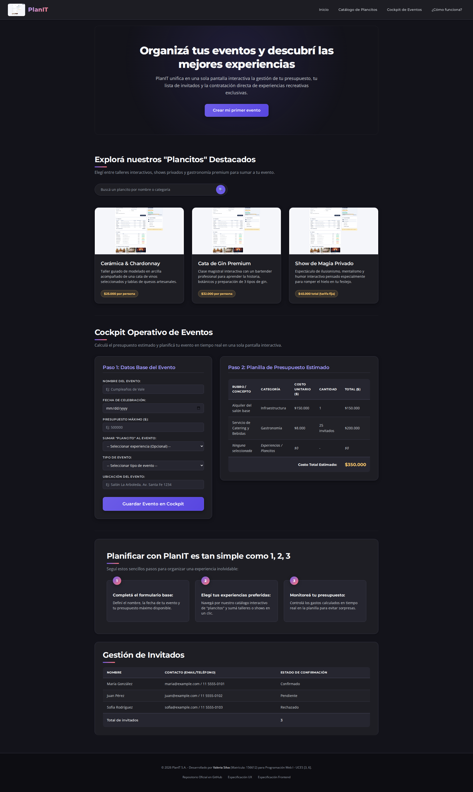
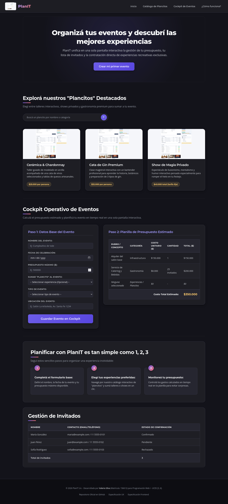
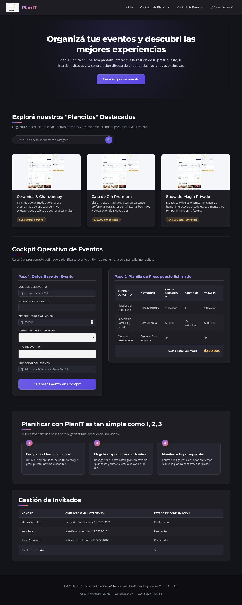
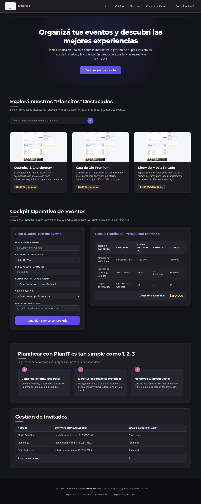

# Test Case 1 — Compatibilidad en navegadores desktop

- **Herramienta:** Playwright (librería directa — el servidor MCP estaba
  configurado con el canal "chrome", no instalado en este entorno Linux;
  se usó Playwright directamente con los mismos motores de renderizado:
  Chromium para Chrome/Edge, Firefox real, y WebKit para aproximar Safari)
- **Navegadores/viewports obligatorios:**
  - Chrome — 1920×1080
  - Firefox — 1440×900
  - Safari/macOS — 1280×800 (aproximado con WebKit en Linux, no macOS real)
  - Edge — 1280×800 (aproximado con Chromium, mismo motor Blink)

---

## Momento 1 — Testing pre-merge (rama feature/)

- **Rama testeada:** `feature/responsive-design-add-responsive-styles`
  (último commit antes del merge a `develop` vía PR #24, incluye también
  el trabajo de `feature/dev-frontend-css-add-styles`)
- **Prompt utilizado:**

\`\`\`
Usá Playwright MCP para testear http://localhost:3000 contra los 4
navegadores/viewports obligatorios del Test Case 1 (compatibilidad
desktop): Chrome 1920×1080, Firefox 1440×900, Safari/macOS 1280×800,
Edge 1280×800.

Para cada uno: navegá a la página, sacá una captura de pantalla completa,
y reportá cualquier problema visual evidente (elementos desbordados,
overlaps, texto cortado, imágenes rotas). Guardá las capturas.
\`\`\`

- **Resultados:**
  - Chequeo automático en los 4 navegadores: sin scroll horizontal
    (`scrollWidth == innerWidth`), sin elementos desbordando el viewport,
    sin imágenes rotas, sin errores de consola/JS.
  - 🔴 **Bug encontrado en Safari/WebKit (1280×800):** los `<select>`
    "Tipo de evento" y "Sumar Plancito al evento" pierden el fondo oscuro
    definido en CSS (`rgb(38,38,48)`). WebKit ignora el `background-color`
    en el widget nativo cerrado y lo pinta con los colores claros del
    sistema, dejando el texto claro sobre fondo claro, prácticamente
    ilegible. Se ve correcto en Chrome, Firefox y Edge.
  - Diferencia menor, no reportada como bug: el input `type="date"` no
    muestra el placeholder "mm/dd/yyyy" ni el ícono de calendario en
    Firefox/Safari (sí en Chrome/Edge) — es comportamiento nativo estándar
    de cada motor, no un defecto del sitio.
- **Capturas:** `capturas/tc-1/momento-1/`

- **Issues generados:** [#25 — Contraste roto en `<select>` con Safari/WebKit](https://github.com/carolabenvenuto-uces/planit/issues/25)

---

## Momento 2 — Testing post-merge (rama develop)

- **Prompt utilizado:**

\`\`\`
(pendiente)
\`\`\`

- **Resultados:** _(pendiente)_
- **Capturas:** `capturas/tc-1/momento-2/`
- **Issues generados:** _(pendiente)_