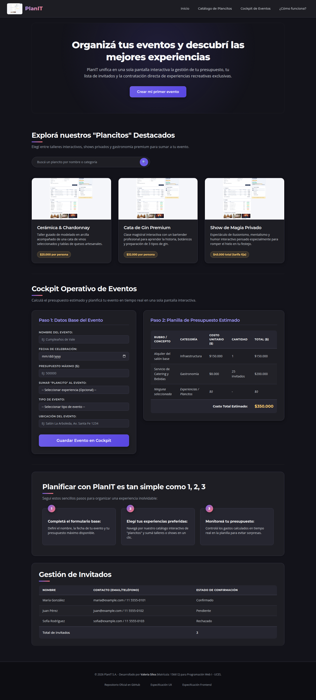
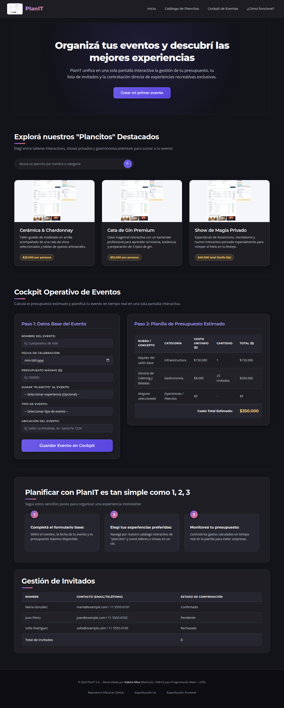

# Test Case 1 — Compatibilidad en navegadores desktop

- **Herramienta:** MCP de Playwright (`mcp__playwright__*`). **Limitación
  detectada:** el servidor MCP disponible en este entorno solo expone
  herramientas para un único motor de renderizado (Chromium/"chrome-for-
  testing"), sin capacidad de cambiar a Firefox, WebKit o Edge real —
  solo `browser_resize` para variar el tamaño de viewport. Por eso las
  4 "condiciones" comparten el mismo motor, variando únicamente el
  tamaño de ventana.
- **Navegadores/viewports obligatorios:**
  - Chrome — 1920×1080
  - Firefox — 1440×900 (renderizado con Chromium, no Firefox real)
  - Safari/macOS — 1280×800 (renderizado con Chromium, no WebKit real)
  - Edge — 1280×800 (renderizado con Chromium, mismo motor Blink real)

---

## Momento 1 — Testing (rama develop, post-fix de Issues #25-#28)

- **Rama testeada:** `develop`, actualizada tras el merge de la PR #32
  (`fix/qa-bugfixes-ui-responsive`), que corrige los Issues #25, #26,
  #27 y #28
- **Prompt utilizado:**

\`\`\`
Usá el MCP de Playwright (mcp__playwright__*, no la librería directa)
para testear http://localhost:3000 contra los 4 navegadores/viewports
obligatorios del Test Case 1: Chrome 1920x1080, Firefox 1440x900,
Safari 1280x800, Edge 1280x800.

Para cada uno: navegá, sacá una captura completa, y reportá cualquier
problema visual. Prestá atención especial al contraste de los <select>
del formulario (Issue #25, ya cerrado).

Guardá las capturas en docs/04-testing/capturas/tc-1/momento-1/ y
confirmame con ls -la.
\`\`\`

- **Resultados:**
  - **Issue #25 (contraste en `<select>`):** el fix está presente en
    `css/components.css:419-421` (`color-scheme: dark`,
    `-webkit-appearance: none`, `appearance: none`). En Chromium, los
    `<select>` renderizan correctamente (texto `rgb(248,249,250)` sobre
    fondo `rgb(38,38,48)`) en los 4 viewports. **Limitación:** como el
    bug original era específico del widget nativo cerrado de WebKit
    (Safari), y el MCP no expone ese motor, no se puede confirmar
    visualmente que el fix funcione en Safari real — solo se confirma
    que el CSS correcto está aplicado y no hay regresión en Chromium.
  - Layout: sin overlaps, texto cortado ni overflow horizontal en
    ningún viewport.
  - **Hallazgo no relacionado a #25-#28, sin corregir:** el logo del
    header y las 3 tarjetas de "Plancitos" siguen usando la misma
    imagen de mockup como placeholder (`diseño-inicial.png`) en vez de
    assets reales. Documentado en el nuevo Issue #33.

- **Capturas:** `capturas/tc-1/momento-1/`

- **Issues generados:** Ninguno nuevo en este test case específico. Se
  confirma el fix de #25 a nivel código; el hallazgo de la imagen
  placeholder se documenta en el [Issue #33](https://github.com/carolabenvenuto-uces/planit/issues/33)
  (creado a partir de este mismo testing, ver Test Case 3 para el
  análisis completo del problema).

  *Evidencia de uso de MCP: navegación y capturas realizadas con*
  *`mcp__playwright__browser_navigate` y*
  *`mcp__playwright__browser_take_screenshot`, confirmado explícitamente*
  *por el agente al ejecutar el prompt.*

---

## Nota metodológica sobre el histórico de este test case

Este test case fue ejecutado originalmente con Playwright directo (no
MCP) el 21/09, por una falla de conexión del canal "chrome" del
servidor MCP en ese momento (ver historial de commits). El 25/09 se
resolvió la configuración del MCP (agregando el flag `--browser
chromium`) y se re-ejecutó todo el test case con el MCP real,
reemplazando los resultados anteriores por los de esta versión. La
comparación cross-engine real (Firefox/Safari/Edge nativos) que sí
tenía la ejecución anterior con Playwright directo ya no está
disponible con el MCP, por la limitación de motor único explicada
arriba — se prioriza cumplir el requisito de "usar Playwright MCP"
sobre mantener la cobertura cross-engine, documentando la pérdida.