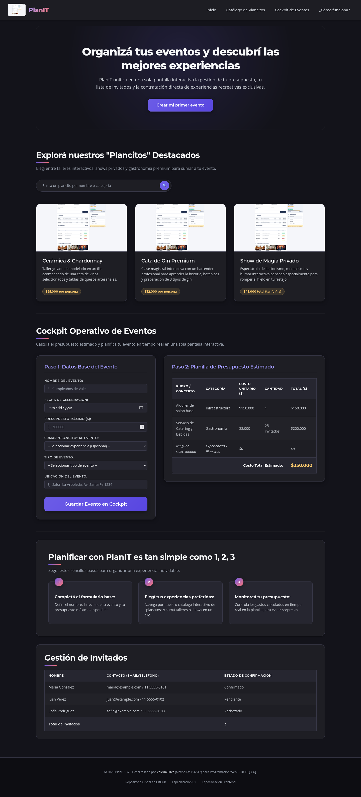
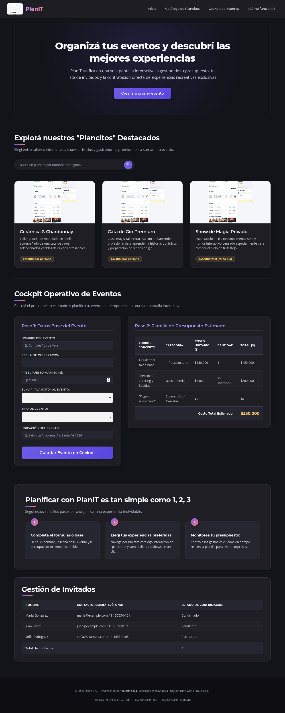
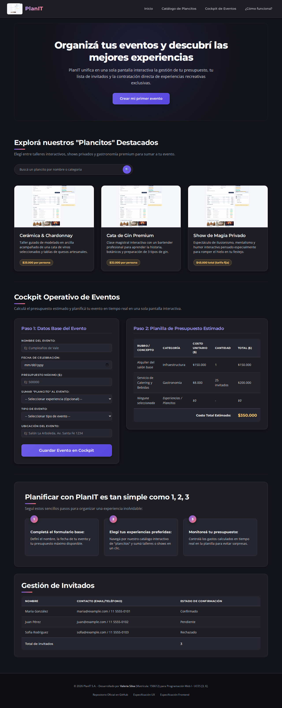
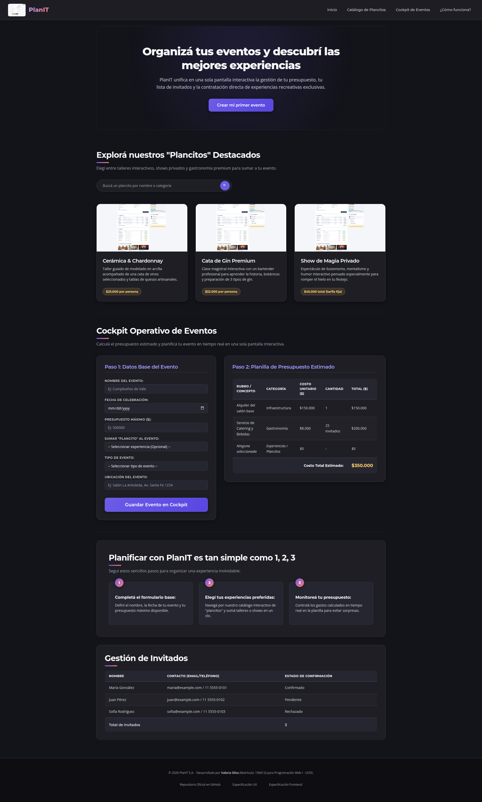
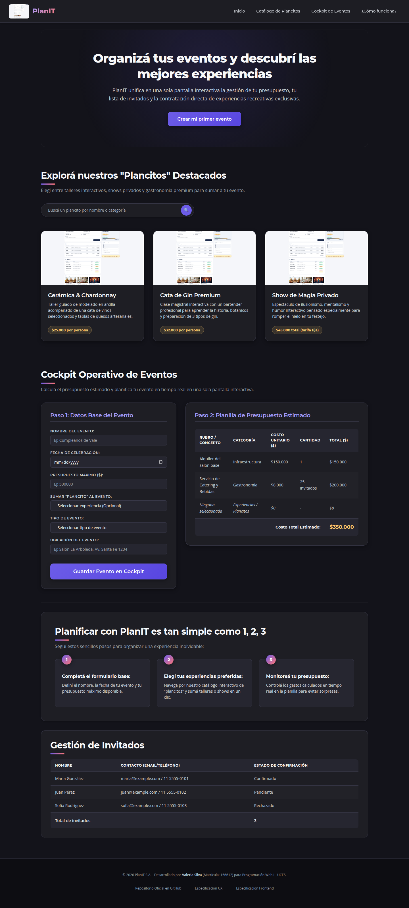
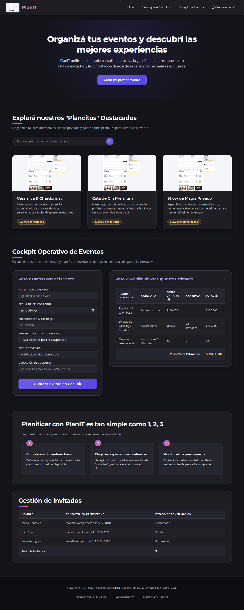

# Test Case 1 — Compatibilidad en navegadores desktop

> **Estructura por momento (corrección RC7):** cada momento indica el estado probado, el prompt, los resultados, las capturas y los issues. El Momento 1 se ejecutó de forma diferida, después del merge (ver [spec-qa.md §5](../03-specs/actividad-obligatoria-2/spec-qa.md)). Los resultados y capturas del 21/09, que habían sido reemplazados por la re-ejecución del 25/09, se restauraron desde el historial de git (commit `d0078e7`).

---

## Momento 1 — Testing pre-merge (diferido, rama feature/)

- **Estado probado:** `feature/responsive-design-add-responsive-styles` @ `1bd2f00` (último commit antes del merge de la PR #24; incluye el trabajo de `feature/dev-frontend-css-add-styles`) — ejecutado el 21/09/2026
- **Herramienta:** Playwright (librería directa — el servidor MCP estaba
  configurado con el canal "chrome", no instalado en este entorno Linux;
  se usó Playwright directamente con los mismos motores de renderizado:
  Chromium para Chrome/Edge, Firefox real, y WebKit para aproximar Safari)
- **Navegadores/viewports obligatorios:**
  - Chrome — 1920×1080
  - Firefox — 1440×900
  - Safari/macOS — 1280×800 (aproximado con WebKit en Linux, no macOS real)
  - Edge — 1280×800 (aproximado con Chromium, mismo motor Blink)
- **Prompt utilizado:**

\`\`\`
Usá Playwright MCP para testear http://localhost:3000 contra los 4
navegadores/viewports obligatorios del Test Case 1 (compatibilidad
desktop): Chrome 1920×1080, Firefox 1440×900, Safari/macOS 1280×800,
Edge 1280×800.

Para cada uno: navegá a la página, sacá una captura de pantalla completa,
y reportá cualquier problema visual evidente (elementos desbordados,
overlaps, texto cortado, imágenes rotas). Guardá las capturas.
\`\`\`

- **Resultados:**
  - Chequeo automático en los 4 navegadores: sin scroll horizontal
    (`scrollWidth == innerWidth`), sin elementos desbordando el viewport,
    sin imágenes rotas, sin errores de consola/JS.
  - 🔴 **Bug encontrado en Safari/WebKit (1280×800):** los `<select>`
    "Tipo de evento" y "Sumar Plancito al evento" pierden el fondo oscuro
    definido en CSS (`rgb(38,38,48)`). WebKit ignora el `background-color`
    en el widget nativo cerrado y lo pinta con los colores claros del
    sistema, dejando el texto claro sobre fondo claro, prácticamente
    ilegible. Se ve correcto en Chrome, Firefox y Edge.
  - Diferencia menor, no reportada como bug: el input `type="date"` no
    muestra el placeholder "mm/dd/yyyy" ni el ícono de calendario en
    Firefox/Safari (sí en Chrome/Edge) — es comportamiento nativo estándar
    de cada motor, no un defecto del sitio.
- **Capturas:** `capturas/tc-1/momento-1/`

- **Issues generados:** [#25 — Contraste roto en `<select>` con Safari/WebKit](https://github.com/carolabenvenuto-uces/planit/issues/25)

---

## Momento 2 — Testing post-merge (rama develop)

### Ejecución 1 — develop post-merge, antes de los fixes

- **Estado probado:** `develop` @ `8393d33` (merge de la PR #24) — 21/09/2026
- **Herramienta:** la misma que en Momento 1.
- **Prompt utilizado:**

\`\`\`
Repetí el Test Case 1 (compatibilidad desktop) contra
http://localhost:3000, esta vez sobre la rama develop (post-merge).
Mismo enfoque que antes: Chromium para Chrome/Edge, Firefox real, WebKit
para Safari, en los 4 viewports. Prestá especial atención a si el bug
de contraste en los <select> de Safari/WebKit (Issue #25) sigue
presente o fue corregido. Guardá las capturas y confirmame con ls -la.
\`\`\`

- **Resultados:**
  - 🔴 **El bug del Issue #25 sigue presente, sin corregir.** Se
    verificó nuevamente el `appearance` computado de los `<select>`
    afectados — sigue en `auto` en los 3 motores, mismo color/background
    que en Momento 1. WebKit sigue pintando el control con el widget
    nativo claro, dejando "Sumar 'Plancito' al Evento" prácticamente
    ilegible. No se aplicó `appearance: none` ni ningún ajuste.
  - Sin otros hallazgos nuevos: 0 imágenes rotas, 0 errores de consola,
    0 desbordes de página en los 4 navegadores/viewports.
- **Capturas:** `capturas/tc-1/momento-2/`

- **Issues generados:** Ninguno nuevo — persiste el Issue #25 ya creado
  en Momento 1, todavía sin resolver.

### Ejecución 2 — develop post-fix, con Playwright MCP

- **Estado probado:** `develop` @ `1fc8d6b` (merge de la PR #32, `fix/qa-bugfixes-ui-responsive`) — 25/09/2026
- **Herramienta:** MCP de Playwright (`mcp__playwright__*`). **Limitación
  detectada:** el servidor MCP disponible en este entorno solo expone
  herramientas para un único motor de renderizado (Chromium/"chrome-for-
  testing"), sin capacidad de cambiar a Firefox, WebKit o Edge real —
  solo `browser_resize` para variar el tamaño de viewport. Por eso las
  4 "condiciones" comparten el mismo motor, variando únicamente el
  tamaño de ventana.
- **Navegadores/viewports obligatorios:**
  - Chrome — 1920×1080
  - Firefox — 1440×900 (renderizado con Chromium, no Firefox real)
  - Safari/macOS — 1280×800 (renderizado con Chromium, no WebKit real)
  - Edge — 1280×800 (renderizado con Chromium, mismo motor Blink real)
- **Prompt utilizado:**

\`\`\`
Usá el MCP de Playwright (mcp__playwright__*, no la librería directa)
para testear http://localhost:3000 contra los 4 navegadores/viewports
obligatorios del Test Case 1: Chrome 1920x1080, Firefox 1440x900,
Safari 1280x800, Edge 1280x800.

Para cada uno: navegá, sacá una captura completa, y reportá cualquier
problema visual. Prestá atención especial al contraste de los <select>
del formulario (Issue #25, ya cerrado).

Guardá las capturas en docs/04-testing/capturas/tc-1/momento-1/ y
confirmame con ls -la.
\`\`\`

- **Resultados:**
  - **Issue #25 (contraste en `<select>`):** el fix está presente en
    `css/components.css:419-421` (`color-scheme: dark`,
    `-webkit-appearance: none`, `appearance: none`). En Chromium, los
    `<select>` renderizan correctamente (texto `rgb(248,249,250)` sobre
    fondo `rgb(38,38,48)`) en los 4 viewports. **Limitación:** como el
    bug original era específico del widget nativo cerrado de WebKit
    (Safari), y el MCP no expone ese motor, no se puede confirmar
    visualmente que el fix funcione en Safari real — solo se confirma
    que el CSS correcto está aplicado y no hay regresión en Chromium.
  - Layout: sin overlaps, texto cortado ni overflow horizontal en
    ningún viewport.
  - **Hallazgo no relacionado a #25-#28, sin corregir:** el logo del
    header y las 3 tarjetas de "Plancitos" siguen usando la misma
    imagen de mockup como placeholder (`diseño-inicial.png`) en vez de
    assets reales. Documentado en el nuevo Issue #33.

- **Capturas:** `capturas/tc-1/momento-2/` (archivos `post-fix-*`)

- **Issues generados:** Ninguno nuevo en este test case específico. Se
  confirma el fix de #25 a nivel código; el hallazgo de la imagen
  placeholder se documenta en el [Issue #33](https://github.com/carolabenvenuto-uces/planit/issues/33)
  (creado a partir de este mismo testing, ver Test Case 3 para el
  análisis completo del problema).

  *Evidencia de uso de MCP: navegación y capturas realizadas con*
  *`mcp__playwright__browser_navigate` y*
  *`mcp__playwright__browser_take_screenshot`, confirmado explícitamente*
  *por el agente al ejecutar el prompt.*

---

## Nota metodológica sobre el histórico de este test case

Este test case fue ejecutado originalmente con Playwright directo (no
MCP) el 21/09, por una falla de conexión del canal "chrome" del
servidor MCP en ese momento (ver historial de commits). El 25/09 se
resolvió la configuración del MCP (agregando el flag `--browser
chromium`) y se re-ejecutó todo el test case con el MCP real,
reemplazando los resultados anteriores por los de esta versión. La
comparación cross-engine real (Firefox/Safari/Edge nativos) que sí
tenía la ejecución anterior con Playwright directo ya no está
disponible con el MCP, por la limitación de motor único explicada
arriba — se prioriza cumplir el requisito de "usar Playwright MCP"
sobre mantener la cobertura cross-engine, documentando la pérdida.
