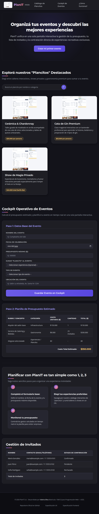

# Test Case 2 — Responsive en dispositivos móviles

- **Herramienta:** MCP de Playwright (`mcp__playwright__*`) con motor
  Chromium. **Limitación:** el MCP solo permite cambiar el tamaño de
  viewport (`browser_resize`), sin emulación real de touch, deviceScaleFactor
  ni user-agent específico de cada dispositivo (a diferencia de la
  librería completa de Playwright, que sí lo permitía).
- **Dispositivos obligatorios:**
  - iPhone 14 Pro — 390×844
  - Samsung Galaxy S23 — 412×915
  - iPad Air — 820×1180

---

## Momento 1 — Testing (rama develop, post-fix de Issues #25-#28)

- **Rama testeada:** `develop`, actualizada tras el merge de la PR #32
- **Prompt utilizado:**

\`\`\`
Usá el MCP de Playwright (mcp__playwright__*) para testear
http://localhost:3000 contra los 3 dispositivos obligatorios del Test
Case 2: iPhone 14 Pro 390x844, Samsung Galaxy S23 412x915, iPad Air
820x1180. Usá browser_resize para cada viewport.

Verificá si el fix de los Issues #26 (tablas desbordadas) y #27 (tap
targets chicos) quedó bien aplicado.

Guardá las capturas en docs/04-testing/capturas/tc-2/momento-1/ y
confirmame con ls -la.
\`\`\`

- **Resultados:**
  - **Issue #26 (tablas desbordadas):** en iPhone (390px) y Galaxy S23
    (412px), las tablas siguen siendo más anchas que el contenedor
    (552px vs ~364px visibles) — esto es **esperado**, el fix no
    elimina el overflow, agrega un indicador visual de scroll. Se
    verificó por CSS computado que `scrollbar-width: thin` y
    `scrollbar-color: rgb(162,155,254) rgb(38,38,48)` (violeta sobre
    fondo oscuro) están correctamente aplicados, junto con las reglas
    `::-webkit-scrollbar` del PR #32. **Limitación:** no se pudo
    confirmar visualmente en la captura, porque Chromium headless en
    Linux usa scrollbars "overlay" (sin espacio reservado, invisibles
    salvo gesto activo real) — el fix está verificado a nivel de
    código, no de captura visual. En iPad Air (820px) la tabla entra
    completa sin overflow, correcto.
  - **Issue #27 (tap targets del footer):** **confirmado y funcionando
    correctamente.** Los 3 links del footer miden 43px de alto en los 3
    dispositivos, muy por encima del mínimo WCAG 2.5.8 de 24px.
  - Sin overflow horizontal a nivel de página completa en ningún
    dispositivo.

- **Capturas:** `capturas/tc-2/momento-1/`

- **Issues generados:** Ninguno nuevo. Issue #27 confirmado resuelto;
  Issue #26 verificado en código (visual no confirmable por limitación
  del entorno headless).

  *Evidencia de uso de MCP: navegación y capturas realizadas con*
  *`mcp__playwright__browser_navigate`, `mcp__playwright__browser_resize`*
  *y `mcp__playwright__browser_take_screenshot`.*

---

## Nota metodológica

Al igual que en Test Case 1, este test case fue re-ejecutado el 25/09
con el MCP real (tras resolver la configuración del canal de
navegador), reemplazando la ejecución anterior con Playwright directo
del 21/09. Se pierde la emulación real de touch/user-agent de cada
dispositivo que sí tenía la librería completa — el MCP solo redimensiona
el viewport.