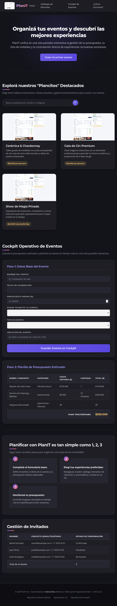

# Test Case 2 — Responsive en dispositivos móviles

> **Estructura por momento (corrección RC7):** cada momento indica el estado probado, el prompt, los resultados, las capturas y los issues. El Momento 1 se ejecutó de forma diferida, después del merge (ver [spec-qa.md §5](../03-specs/actividad-obligatoria-2/spec-qa.md)). Los resultados y capturas del 21/09, que habían sido reemplazados por la re-ejecución del 25/09, se restauraron desde el historial de git (commit `d0078e7`).

---

## Momento 1 — Testing pre-merge (diferido, rama feature/)

- **Estado probado:** `feature/responsive-design-add-responsive-styles` @ `1bd2f00` (último commit antes del merge de la PR #24; incluye el trabajo de `feature/dev-frontend-css-add-styles`) — ejecutado el 21/09/2026
- **Herramienta:** Playwright (librería directa, mismo enfoque que
  Test Case 1) — WebKit para dispositivos iOS (motor real de Safari),
  Chromium para Android (motor real de Chrome), con emulación completa
  de viewport, deviceScaleFactor, touch y user-agent de cada dispositivo
- **Dispositivos obligatorios:**
  - iPhone 14 Pro — 390×844
  - Samsung Galaxy S23 — 412×915
  - iPad Air — 820×1180
- **Prompt utilizado:**

\`\`\`
Usando Playwright directamente (no MCP, mismo enfoque que usaste en el
Test Case 1), testeá http://localhost:3000 contra los 3 dispositivos
obligatorios del Test Case 2 (responsive en dispositivos móviles), usando
viewport emulation: iPhone 14 Pro 390×844, Samsung Galaxy S23 412×915,
iPad Air 820×1180.

Para cada uno: navegá a la página, sacá una captura de pantalla completa,
y reportá cualquier problema de responsive (elementos desbordados,
overlap, texto cortado, botones inaccesibles, scroll horizontal). Guardá
las capturas.
\`\`\`

- **Resultados:**
  - Sin errores de consola/JS, sin imágenes rotas, sin scroll horizontal
    a nivel de página en ninguno de los 3 dispositivos.
  - 🟡 **Tablas desbordan su contenedor en iPhone 14 Pro y Galaxy S23:**
    las tablas de "Planilla de Presupuesto Estimado" y "Gestión de
    Invitados" (ancho fijo ~520px) cortan las columnas TOTAL ($) y parte
    de CANTIDAD/ESTADO DE CONFIRMACIÓN en viewports de 390px/412px. El
    contenido no se pierde (hay `overflow-x: auto`), pero no hay
    indicador visual de que existe más contenido para scrollear. No
    ocurre en iPad Air (820px).
  - 🟡 **Links de footer con tap target chico:** "Repositorio Oficial en
    GitHub", "Especificación UX" y "Especificación Frontend" miden ~17px
    de alto, por debajo del mínimo recomendado de 24px (WCAG 2.5.8).
    Impacto bajo, links secundarios.
  - Sin otros hallazgos: no hay overlaps ni texto cortado visible (el
    único elemento "clipped" detectado automáticamente fue un `<label>`
    intencionalmente oculto para accesibilidad — `sr-only`, no es bug).
- **Capturas:** `capturas/tc-2/momento-1/`

- **Issues generados:**
  - [#26 — Tablas desbordan sin indicador de scroll en mobile](https://github.com/carolabenvenuto-uces/planit/issues/26)
  - [#27 — Links de footer con área de toque menor al mínimo WCAG](https://github.com/carolabenvenuto-uces/planit/issues/27)

---

## Momento 2 — Testing post-merge (rama develop)

### Ejecución 1 — develop post-merge, antes de los fixes

- **Estado probado:** `develop` @ `8393d33` (merge de la PR #24) — 21/09/2026
- **Herramienta:** la misma que en Momento 1.
- **Prompt utilizado:**

\`\`\`
Repetí el Test Case 2 (responsive en dispositivos móviles) contra
http://localhost:3000, esta vez sobre la rama develop (post-merge).
Mismo enfoque que antes: iPhone 14 Pro 390×844, Samsung Galaxy S23
412×915, iPad Air 820×1180. Prestá especial atención a si los 2
hallazgos reportados en Momento 1 siguen presentes (Issue #26: tablas
desbordadas; Issue #27: tap targets chicos). Guardá las capturas y
confirmame con ls -la.
\`\`\`

- **Resultados:**
  - 🔴 **Issue #26 sigue presente, sin corregir.** Las tablas "Planilla
    de Presupuesto Estimado" y "Gestión de Invitados" siguen desbordando
    su contenedor en iPhone (520px de tabla vs 366px de contenedor) y
    Galaxy S23 (520px vs 388px). Se detectó que `.cockpit-table` ahora
    tiene un `box-shadow` genérico de tarjeta, pero no funciona como
    indicador de scroll (es difuso, sin dirección horizontal), y
    `.invitados-section` sigue sin ningún indicador. Sin cambios en
    iPad Air.
  - 🔴 **Issue #27 sigue presente, sin corregir.** Los 3 links del
    footer siguen midiendo 17px de alto en los 3 dispositivos, sin
    cambios respecto a Momento 1.
  - Sin errores de consola nuevos ni otros hallazgos.
- **Capturas:** `capturas/tc-2/momento-2/`

- **Issues generados:** Ninguno nuevo — persisten los Issues #26 y #27
  ya creados en Momento 1, todavía sin resolver.

### Ejecución 2 — develop post-fix, con Playwright MCP

- **Estado probado:** `develop` @ `1fc8d6b` (merge de la PR #32, `fix/qa-bugfixes-ui-responsive`) — 25/09/2026
- **Herramienta:** MCP de Playwright (`mcp__playwright__*`) con motor
  Chromium. **Limitación:** el MCP solo permite cambiar el tamaño de
  viewport (`browser_resize`), sin emulación real de touch, deviceScaleFactor
  ni user-agent específico de cada dispositivo (a diferencia de la
  librería completa de Playwright, que sí lo permitía).
- **Dispositivos obligatorios:**
  - iPhone 14 Pro — 390×844
  - Samsung Galaxy S23 — 412×915
  - iPad Air — 820×1180
- **Prompt utilizado:**

\`\`\`
Usá el MCP de Playwright (mcp__playwright__*) para testear
http://localhost:3000 contra los 3 dispositivos obligatorios del Test
Case 2: iPhone 14 Pro 390x844, Samsung Galaxy S23 412x915, iPad Air
820x1180. Usá browser_resize para cada viewport.

Verificá si el fix de los Issues #26 (tablas desbordadas) y #27 (tap
targets chicos) quedó bien aplicado.

Guardá las capturas en docs/04-testing/capturas/tc-2/momento-1/ y
confirmame con ls -la.
\`\`\`

- **Resultados:**
  - **Issue #26 (tablas desbordadas):** en iPhone (390px) y Galaxy S23
    (412px), las tablas siguen siendo más anchas que el contenedor
    (552px vs ~364px visibles) — esto es **esperado**, el fix no
    elimina el overflow, agrega un indicador visual de scroll. Se
    verificó por CSS computado que `scrollbar-width: thin` y
    `scrollbar-color: rgb(162,155,254) rgb(38,38,48)` (violeta sobre
    fondo oscuro) están correctamente aplicados, junto con las reglas
    `::-webkit-scrollbar` del PR #32. **Limitación:** no se pudo
    confirmar visualmente en la captura, porque Chromium headless en
    Linux usa scrollbars "overlay" (sin espacio reservado, invisibles
    salvo gesto activo real) — el fix está verificado a nivel de
    código, no de captura visual. En iPad Air (820px) la tabla entra
    completa sin overflow, correcto.
  - **Issue #27 (tap targets del footer):** **confirmado y funcionando
    correctamente.** Los 3 links del footer miden 43px de alto en los 3
    dispositivos, muy por encima del mínimo WCAG 2.5.8 de 24px.
  - Sin overflow horizontal a nivel de página completa en ningún
    dispositivo.

- **Capturas:** `capturas/tc-2/momento-2/` (archivos `post-fix-*`)

- **Issues generados:** Ninguno nuevo. Issue #27 confirmado resuelto;
  Issue #26 verificado en código (visual no confirmable por limitación
  del entorno headless).

  *Evidencia de uso de MCP: navegación y capturas realizadas con*
  *`mcp__playwright__browser_navigate`, `mcp__playwright__browser_resize`*
  *y `mcp__playwright__browser_take_screenshot`.*

---

## Nota metodológica

Al igual que en Test Case 1, este test case fue re-ejecutado el 25/09
con el MCP real (tras resolver la configuración del canal de
navegador), reemplazando la ejecución anterior con Playwright directo
del 21/09. Se pierde la emulación real de touch/user-agent de cada
dispositivo que sí tenía la librería completa — el MCP solo redimensiona
el viewport.
