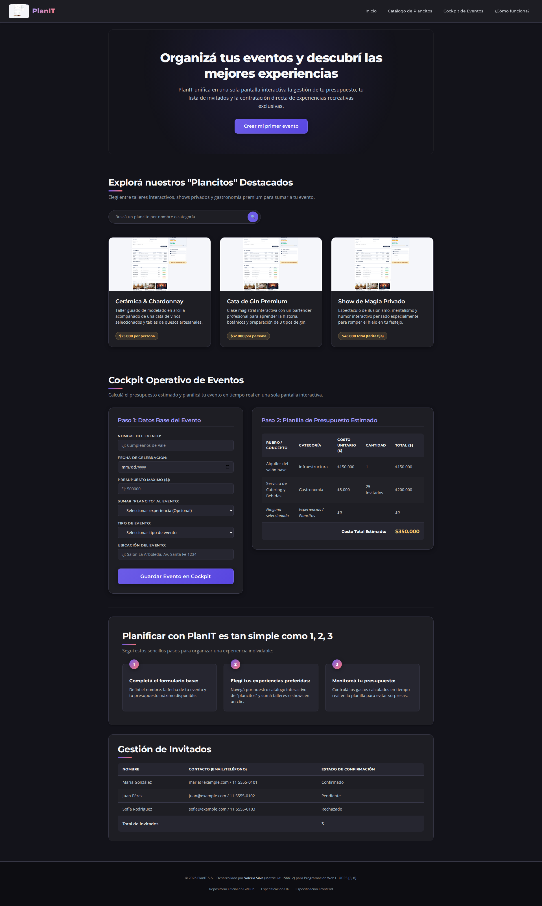

# Test Case 3 — Performance y Carga

- **Herramienta:** Playwright (librería directa) con Chromium (Chrome
  real), usando la Performance API del navegador
  (`performance.getEntriesByType("navigation")` y `"resource"`)
- **Métricas obligatorias:**
  - DOMContentLoaded
  - Load completo
  - DOM Interactive
  - Listado de recursos con tamaño y tiempo de descarga

---

## Momento 1 — Testing pre-merge (rama feature/)

- **Rama testeada:** `feature/responsive-design-add-responsive-styles`
  (último commit antes del merge a `develop` vía PR #24)
- **Prompt utilizado:**

\`\`\`
Usando Playwright directamente (mismo enfoque que los test cases
anteriores), testeá http://localhost:3000 evaluando performance con la
Performance API del navegador. Necesito estas métricas obligatorias:
DOMContentLoaded, Load completo (evento load), DOM Interactive, listado
de recursos cargados con su tamaño y tiempo de descarga (usando
performance.getEntriesByType("resource")).

Sacá una captura de pantalla de la página cargada, y reportá si alguna
métrica parece anormalmente alta. Guardá la captura.
\`\`\`

- **Resultados:**

  | Métrica | Valor |
  |---|---|
  | DOM Interactive | 66.5 ms |
  | DOMContentLoaded | 66.6 ms |
  | Load completo | 160.8 ms |

  Todo dentro de rangos excelentes para un sitio HTML/CSS estático
  (referencia típica: DCL <1-2s, load <3s en conexión normal).

  | Recurso | Tipo | Transfer size | Duración |
  |---|---|---|---|
  | css/styles.css | link | 3.5 KB | 51.8 ms |
  | css/components.css | link | 4.8 KB | 42.2 ms |
  | css/responsive.css | link | 2.4 KB | 45.4 ms |
  | fonts.googleapis.com (Montserrat/Open Sans) | css | 2.4 KB | 73.6 ms |
  | diseño-inicial.png (mockup) | img | 235.3 KB | 47.7 ms |

  Total transferido: ~248.5 KB. El 95% de ese peso es una sola imagen.

  🔴 **Hallazgo:** `diseño-inicial.png` (1440×1024px, 235 KB) se
  reutiliza 4 veces sobredimensionada — como logo del header
  (renderizado a 70×50) y como thumbnail en las 3 tarjetas de "Plancitos
  Destacados" (renderizado a 361×189 cada una). Es claramente un
  placeholder de desarrollo, no un asset de producción.

- **Capturas:** `capturas/tc-3/momento-1/`

- **Issues generados:**
  - [#28 — Imagen de mockup reutilizada sin optimizar](https://github.com/carolabenvenuto-uces/planit/issues/28)

---

## Momento 2 — Testing post-merge (rama develop)

- **Prompt utilizado:**

\`\`\`
(pendiente)
\`\`\`

- **Resultados:** _(pendiente)_
- **Capturas:** `capturas/tc-3/momento-2/`
- **Issues generados:** _(pendiente)_
