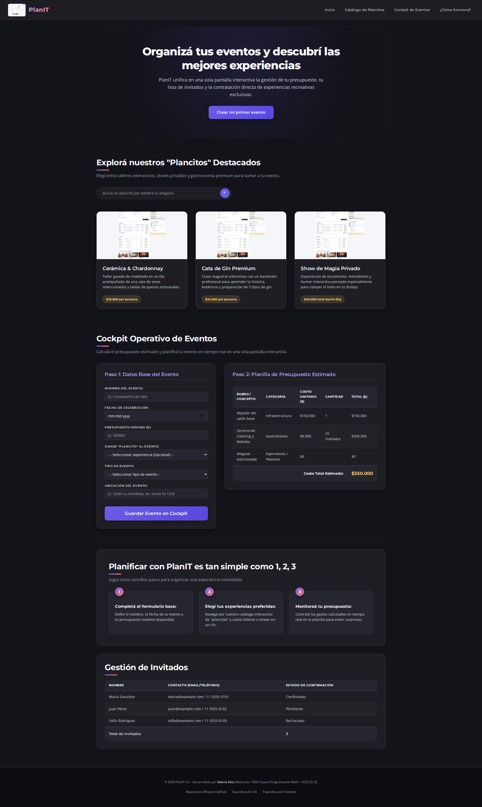
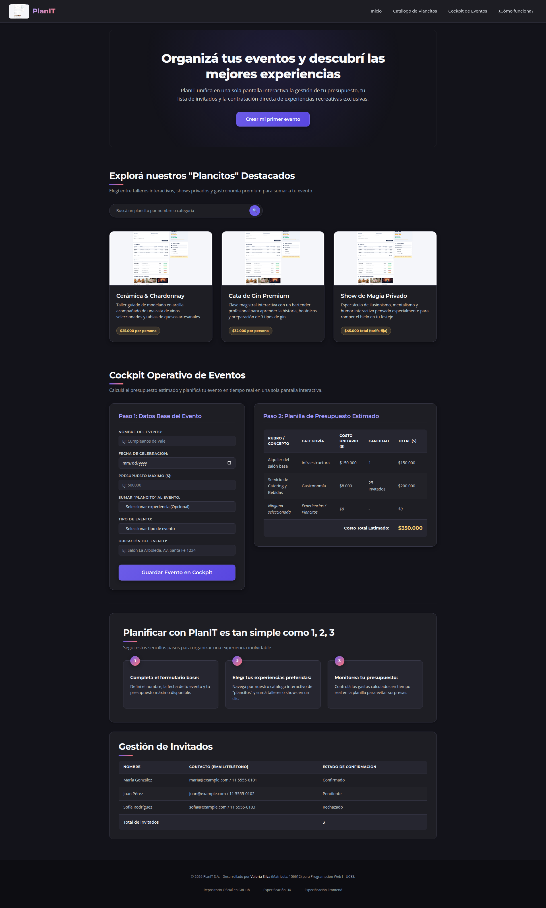

# Test Case 3 — Performance y Carga

> **Estructura por momento (corrección RC7):** cada momento indica el estado probado, el prompt, los resultados, las capturas y los issues. El Momento 1 se ejecutó de forma diferida, después del merge (ver [spec-qa.md §5](../03-specs/actividad-obligatoria-2/spec-qa.md)). Los resultados y capturas del 21/09, que habían sido reemplazados por la re-ejecución del 25/09, se restauraron desde el historial de git (commit `d0078e7`).

---

## Momento 1 — Testing pre-merge (diferido, rama feature/)

- **Estado probado:** `feature/responsive-design-add-responsive-styles` @ `1bd2f00` (último commit antes del merge de la PR #24; incluye el trabajo de `feature/dev-frontend-css-add-styles`) — ejecutado el 21/09/2026
- **Herramienta:** Playwright (librería directa) con Chromium (Chrome
  real), usando la Performance API del navegador
  (`performance.getEntriesByType("navigation")` y `"resource"`)
- **Métricas obligatorias:**
  - DOMContentLoaded
  - Load completo
  - DOM Interactive
  - Listado de recursos con tamaño y tiempo de descarga
- **Prompt utilizado:**

\`\`\`
Usando Playwright directamente (mismo enfoque que los test cases
anteriores), testeá http://localhost:3000 evaluando performance con la
Performance API del navegador. Necesito estas métricas obligatorias:
DOMContentLoaded, Load completo (evento load), DOM Interactive, listado
de recursos cargados con su tamaño y tiempo de descarga (usando
performance.getEntriesByType("resource")).

Sacá una captura de pantalla de la página cargada, y reportá si alguna
métrica parece anormalmente alta. Guardá la captura.
\`\`\`

- **Resultados:**

  | Métrica | Valor |
  |---|---|
  | DOM Interactive | 66.5 ms |
  | DOMContentLoaded | 66.6 ms |
  | Load completo | 160.8 ms |

  Todo dentro de rangos excelentes para un sitio HTML/CSS estático
  (referencia típica: DCL <1-2s, load <3s en conexión normal).

  | Recurso | Tipo | Transfer size | Duración |
  |---|---|---|---|
  | css/styles.css | link | 3.5 KB | 51.8 ms |
  | css/components.css | link | 4.8 KB | 42.2 ms |
  | css/responsive.css | link | 2.4 KB | 45.4 ms |
  | fonts.googleapis.com (Montserrat/Open Sans) | css | 2.4 KB | 73.6 ms |
  | diseño-inicial.png (mockup) | img | 235.3 KB | 47.7 ms |

  Total transferido: ~248.5 KB. El 95% de ese peso es una sola imagen.

  🔴 **Hallazgo:** `diseño-inicial.png` (1440×1024px, 235 KB) se
  reutiliza 4 veces sobredimensionada — como logo del header
  (renderizado a 70×50) y como thumbnail en las 3 tarjetas de "Plancitos
  Destacados" (renderizado a 361×189 cada una). Es claramente un
  placeholder de desarrollo, no un asset de producción.

- **Capturas:** `capturas/tc-3/momento-1/`

- **Issues generados:**
  - [#28 — Imagen de mockup reutilizada sin optimizar](https://github.com/carolabenvenuto-uces/planit/issues/28)

---

## Momento 2 — Testing post-merge (rama develop)

### Ejecución 1 — develop post-merge, antes de los fixes

- **Estado probado:** `develop` @ `8393d33` (merge de la PR #24) — 21/09/2026
- **Herramienta:** la misma que en Momento 1.
- **Prompt utilizado:**

\`\`\`
Repetí el Test Case 3 (performance) contra http://localhost:3000, esta
vez sobre la rama develop (post-merge). Mismo enfoque que antes:
Chromium, Performance API. Prestá especial atención a si el hallazgo
del Issue #28 (imagen de mockup sobredimensionada) sigue presente.
Guardá la captura y confirmame con ls -la.
\`\`\`

- **Resultados:**

  | Métrica | Valor |
  |---|---|
  | DOM Interactive | 60.7 ms |
  | DOMContentLoaded | 61.2 ms |
  | Load completo | 112.8 ms |

  Todo rápido, levemente mejor incluso que en Momento 1 (load 160.8ms
  → 112.8ms).

  🔴 **Issue #28 sigue presente, sin corregir.** `diseño-inicial.png`
  (1440×1024px, 235 KB) se sigue usando exactamente igual: como logo
  del header (70×50) y en las 3 tarjetas de "Plancitos Destacados"
  (361×189 cada una). Peso total transferido ~273 KB, de los cuales
  235 KB (86%) siguen siendo esta única imagen sin optimizar.

- **Capturas:** `capturas/tc-3/momento-2/`

- **Issues generados:** Ninguno nuevo — persiste el Issue #28 ya creado
  en Momento 1, todavía sin resolver.

### Ejecución 2 — develop post-fix, con Playwright MCP

- **Estado probado:** `develop` @ `1fc8d6b` (merge de la PR #32, `fix/qa-bugfixes-ui-responsive`) — 25/09/2026
- **Herramienta:** MCP de Playwright (`mcp__playwright__*`) con
  Chromium, usando la Performance API del navegador
- **Métricas obligatorias:**
  - DOMContentLoaded
  - Load completo
  - DOM Interactive
  - Listado de recursos con tamaño y tiempo de descarga
- **Prompt utilizado:**

\`\`\`
Usá el MCP de Playwright (mcp__playwright__*) para testear
http://localhost:3000 evaluando performance con la Performance API.
Necesito: DOMContentLoaded, Load completo, DOM Interactive, y listado
de recursos con tamaño y duración.

Verificá también si el peso total bajó respecto a la medición anterior
(antes del fix del Issue #28), considerando que ahora el lazy-loading
está aplicado a 3 de las 4 imágenes placeholder.

Sacá una captura y guardala en docs/04-testing/capturas/tc-3/momento-1/.
Confirmame con ls -la.
\`\`\`

- **Resultados:**

  | Métrica | Valor |
  |---|---|
  | DOM Interactive | 55 ms |
  | DOMContentLoaded | 55 ms |
  | Load completo | 89 ms |
  | Response End (HTML) | 8 ms |

  | Recurso | Tamaño | Duración |
  |---|---|---|
  | HTML (documento) | 13.4 KB | — |
  | styles.css | 8.8 KB | 0 ms |
  | components.css | 19.4 KB | 10.7 ms |
  | responsive.css | 7.3 KB | 10.7 ms |
  | diseño-inicial.png (mockup) | 235.0 KB | 0 ms |
  | Google Fonts (CSS + 3 .woff2) | ~97 KB | 0 ms |

  Peso total estimado: ~354 KB. La imagen del mockup sigue
  representando ~66% del peso total de la página.

  🔴 **El peso NO bajó tras el fix del Issue #28, y no podía bajar con
  ese fix.** Verificado con la Performance API: solo aparece **una**
  entrada de red para la imagen (no cuatro), aunque hay 4 ``
  apuntando al mismo archivo — el navegador deduplica y descarga el
  recurso una sola vez por URL, sin importar cuántos `` lo
  referencien ni si son `eager` o `lazy`. Además, el logo del header
  (el único de los 4 usos que **no** recibió `loading="lazy"`) sigue
  siendo `eager` y aparece primero en el DOM — fuerza la descarga
  completa de los 235 KB apenas carga la página, antes de que el
  lazy-loading de las 3 tarjetas pueda tener efecto. **En la práctica,
  marcar las otras 3 instancias como lazy es un no-op de performance.**

- **Capturas:** `capturas/tc-3/momento-2/` (archivos `post-fix-*`)

- **Issues generados:** [#33 — Logo y tarjetas de Plancitos siguen usando el mockup como placeholder (Issue #28 solo agregó lazy-loading)](https://github.com/carolabenvenuto-uces/planit/issues/33)

  Este issue documenta que el fix del Issue #28 fue parcial: revisando
  el diff exacto del PR #32 (vía MCP de GitHub), el único cambio
  aplicado fue agregar `loading="lazy"` a las 3 tarjetas — el `src`
  sigue siendo el mismo mockup en los 4 usos, y el logo del header ni
  siquiera recibió el cambio. El problema de fondo (contenido
  placeholder en producción) sigue sin resolver, y este análisis de
  performance confirma que el fix aplicado no tiene ningún impacto real
  en bytes transferidos ni tiempo de carga.

  *Evidencia de uso de MCP: métricas obtenidas con*
  *`mcp__playwright__browser_evaluate` (Performance API) y captura con*
  *`mcp__playwright__browser_take_screenshot`. El Issue #33 se creó con*
  *el servidor `github` MCP, consultando también el Issue #28 y el diff*
  *del PR #32 vía las mismas herramientas.*

---

## Nota metodológica

Re-ejecutado el 25/09 sobre `develop` con MCP real, reemplazando la
medición del 21/09 (Playwright directo, sobre la rama pre-fix de
Carola). Las métricas de tiempo mejoraron levemente respecto a la
medición original (160.8ms → 89ms de load), pero esto es más atribuible
a variabilidad de caché/timing entre corridas que a una mejora real de
performance — el análisis de recursos confirma que el peso transferido
no cambió de forma significativa.
