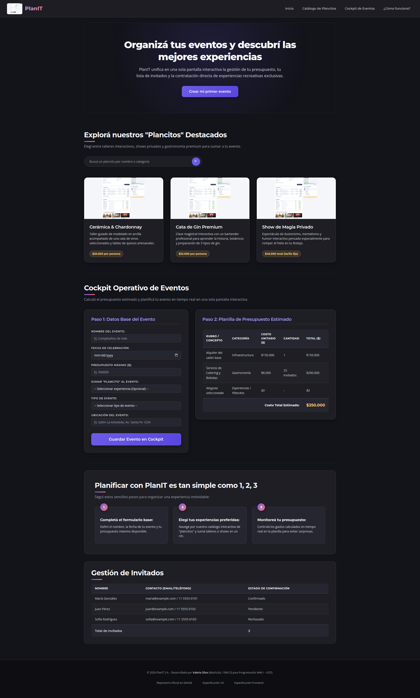

# Test Case 4 — Accesibilidad Web

> **Estructura por momento (corrección RC7):** cada momento indica el estado probado, el prompt, los resultados, las capturas y los issues. El Momento 1 se ejecutó de forma diferida, después del merge (ver [spec-qa.md §5](../03-specs/actividad-obligatoria-2/spec-qa.md)). Los resultados y capturas del 21/09, que habían sido reemplazados por la re-ejecución del 25/09, se restauraron desde el historial de git (commit `d0078e7`).

---

## Momento 1 — Testing pre-merge (diferido, rama feature/)

- **Estado probado:** `feature/responsive-design-add-responsive-styles` @ `1bd2f00` (último commit antes del merge de la PR #24; incluye el trabajo de `feature/dev-frontend-css-add-styles`) — ejecutado el 21/09/2026
- **Herramienta:** Playwright (librería directa) con Chromium, inyectando
  axe-core v4.10.2 (`page.addScriptTag` + `axe.run()`) con reglas WCAG
  2.1 A/AA (`wcag2a`, `wcag2aa`, `wcag21a`, `wcag21aa`)
- **Criterios obligatorios:**
  - Violaciones WCAG 2.1 por nivel de impacto (critical, serious, moderate, minor)
  - Elementos afectados
  - Regla axe correspondiente
- **Prompt utilizado:**

\`\`\`
Usando Playwright directamente (mismo enfoque que los test cases
anteriores), testeá http://localhost:3000 inyectando axe-core para
evaluar accesibilidad web (WCAG 2.1). Necesito todas las violaciones
encontradas, categorizadas por nivel de impacto (critical, serious,
moderate, minor), los elementos afectados por cada violación, y la
regla axe correspondiente a cada una.

Sacá una captura de pantalla de la página, guardala en
docs/04-testing/capturas/tc-4/momento-1/ y confirmame con ls -la.
\`\`\`

- **Resultados:**
  - **Violaciones encontradas: 0.** 29 reglas WCAG 2.1 A/AA pasaron
    correctamente. Sin hallazgos critical, serious, moderate ni minor.
  - 🟡 **1 ítem "incomplete" (no es violación, requiere revisión manual):**

    | Regla axe | Elementos afectados | Motivo |
    |---|---|---|
    | color-contrast | `.logo-container > span` ("PlanIT"), `h1` (título hero), `.hero-section > p`, `.btn-primary` ("Crear mi primer evento"), `.btn-submit` ("Guardar Evento en Cockpit") | axe no puede calcular el contraste automáticamente porque el fondo usa un gradiente CSS |

    Por inspección visual de las capturas de test cases anteriores el
    contraste se ve bien (texto blanco sobre fondo oscuro/gradiente
    púrpura), pero se recomienda verificar con una herramienta de
    contraste manual (ej. color picker de DevTools) sobre los puntos más
    claros del gradiente antes de darlo por cerrado formalmente.

- **Capturas:** `capturas/tc-4/momento-1/`

- **Issues generados:** Ninguno — no hubo violaciones automáticas
  confirmadas. El ítem de contraste con gradiente queda documentado como
  pendiente de verificación manual, no como bug.

---

## Momento 2 — Testing post-merge (rama develop)

### Ejecución 1 — develop post-merge, antes de los fixes

- **Estado probado:** `develop` @ `8393d33` (merge de la PR #24) — 21/09/2026
- **Herramienta:** la misma que en Momento 1.
- **Prompt utilizado:**

\`\`\`
Repetí el Test Case 4 (accesibilidad) contra http://localhost:3000,
esta vez sobre la rama develop (post-merge). Mismo enfoque: axe-core
v4.10.2 con reglas WCAG 2.1 A/AA. Verificá especialmente si el ítem
"incomplete" de color-contrast sigue apareciendo. Guardá la captura y
confirmame con ls -la.
\`\`\`

- **Resultados:**
  - **Violaciones: 0.** 29 reglas WCAG 2.1 A/AA pasan correctamente,
    igual que en Momento 1.
  - El ítem "incomplete" de `color-contrast` sigue apareciendo, sin
    cambios — mismos 5 elementos exactos que en Momento 1
    (`.logo-container > span`, `h1`, `.hero-section > p`,
    `.btn-primary`, `.btn-submit`), por el mismo motivo (fondo con
    gradiente CSS que axe no puede calcular estáticamente). No es una
    violación confirmada. Sigue pendiente de verificación manual si se
    quiere cerrar el punto formalmente.

- **Capturas:** `capturas/tc-4/momento-2/`

- **Issues generados:** Ninguno — mismo resultado limpio que en
  Momento 1, sin violaciones automáticas confirmadas.

### Ejecución 2 — develop post-fix, con Playwright MCP

- **Estado probado:** `develop` @ `1fc8d6b` (merge de la PR #32, `fix/qa-bugfixes-ui-responsive`) — 25/09/2026
- **Herramienta:** MCP de Playwright (`mcp__playwright__*`) con
  Chromium, inyectando axe-core 4.9.1 con reglas WCAG 2.1 A/AA
- **Criterios obligatorios:**
  - Violaciones WCAG 2.1 por nivel de impacto (critical, serious, moderate, minor)
  - Elementos afectados
  - Regla axe correspondiente
- **Prompt utilizado:**

\`\`\`
Usá el MCP de Playwright (mcp__playwright__*) para inyectar axe-core en
http://localhost:3000 y evaluar accesibilidad WCAG 2.1 A/AA. Necesito:
violaciones por nivel de impacto, elementos afectados, y regla axe
correspondiente.

Sacá una captura y guardala en docs/04-testing/capturas/tc-4/momento-1/.
Confirmame con ls -la.
\`\`\`

- **Resultados:**

  | Categoría | Cantidad |
  |---|---|
  | Violations (fallos confirmados) | 0 |
  | Passes | 29 |
  | Incomplete (revisión manual) | 1 regla, 5 elementos |
  | Inapplicable | 33 |

  **Cero violaciones automáticas** de ningún nivel de impacto
  (critical/serious/moderate/minor) en las reglas WCAG 2.1 A/AA
  evaluadas.

  El único ítem "incomplete": `color-contrast` (impacto serious) en 5
  elementos: `.logo-container > span`, `h1`, `.hero-section > p`,
  `.btn-primary`, `.btn-submit`. Motivo: los 5 tienen fondo con
  gradiente (no color sólido), algo que axe no resuelve
  automáticamente — no es un fallo, requiere verificación manual.

  **Verificación manual realizada** (peor extremo de cada gradiente):

  | Elemento | Contraste | Resultado |
  |---|---|---|
  | Logo "PlanIT" (gradiente violeta→coral) | ~6.5–6.9:1 | ✅ Pasa |
  | h1 (gradiente radial sutil 15%) | >15:1 | ✅ Pasa ampliamente |
  | .hero-section > p | Muy alto | ✅ Pasa ampliamente |
  | .btn-primary / .btn-submit (gradiente violeta) | ~4.86:1 | ✅ Pasa AA (mínimo 4.5:1, margen ajustado) |

  **Conclusión:** sin violaciones reales de contraste. Los botones son
  el caso más ajustado (~4.86:1 contra el mínimo de 4.5:1) — vale
  tenerlo en el radar si en el futuro se oscurece ese extremo del
  gradiente, pero hoy cumple.

- **Capturas:** `capturas/tc-4/momento-2/` (archivos `post-fix-*`)

- **Issues generados:** Ninguno — 0 violaciones confirmadas, contraste
  verificado manualmente sin hallazgos.

  *Evidencia de uso de MCP: axe-core inyectado y ejecutado vía*
  *`mcp__playwright__browser_evaluate`, captura con*
  *`mcp__playwright__browser_take_screenshot`.*

---

## Nota metodológica

Re-ejecutado el 25/09 sobre `develop` con MCP real, reemplazando la
ejecución del 21/09 (Playwright directo, rama pre-fix). Resultado
consistente con la medición anterior: sin violaciones en ninguna de
las dos corridas.
